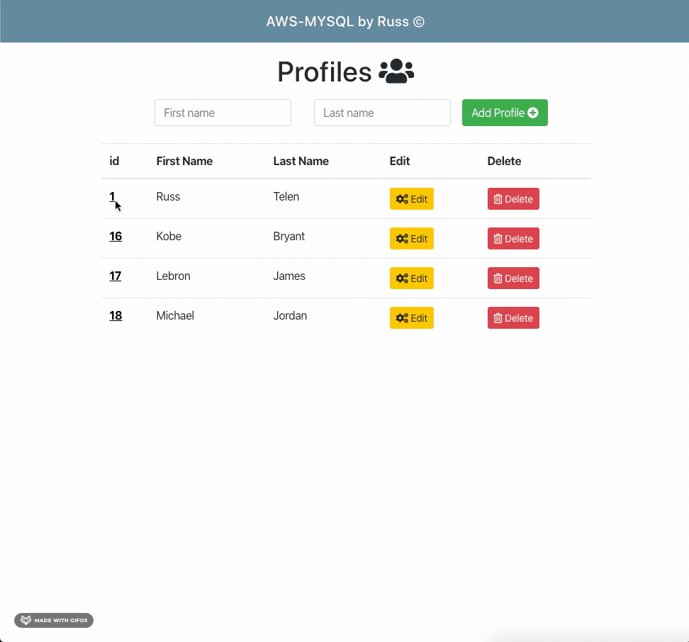

# Full Stack Serverless App

## About

    Full stack serverless app built with AWS services and React.

    AWS Services used are:
    - RDS
    - Lambda
    - API gateway

    Users are able to create, view, update and delete a 'Profile'

## Preview

### `Add Profile`

### `Update Profile`

### `View Profile`

### `Delete Profile`

